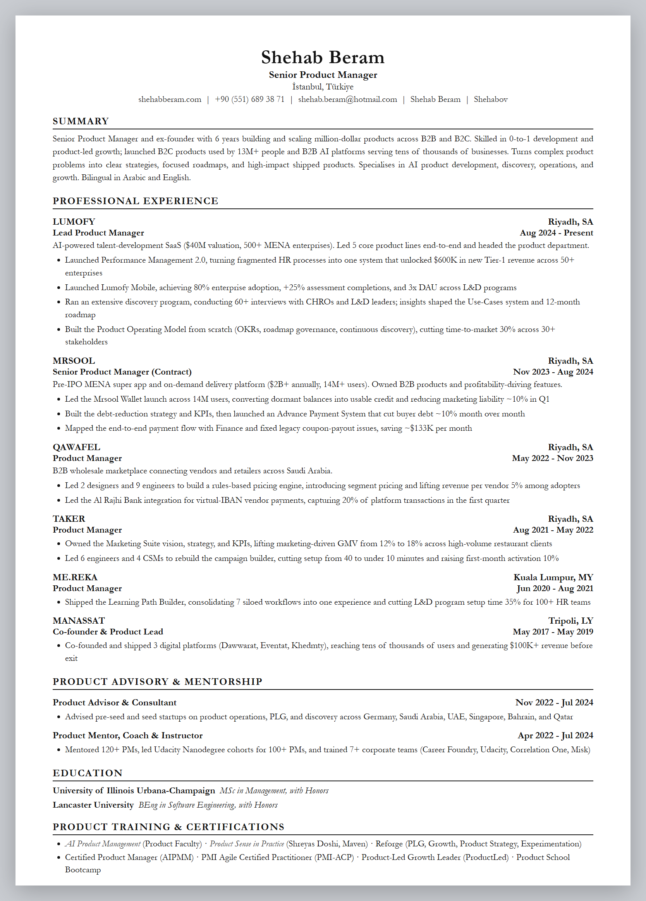
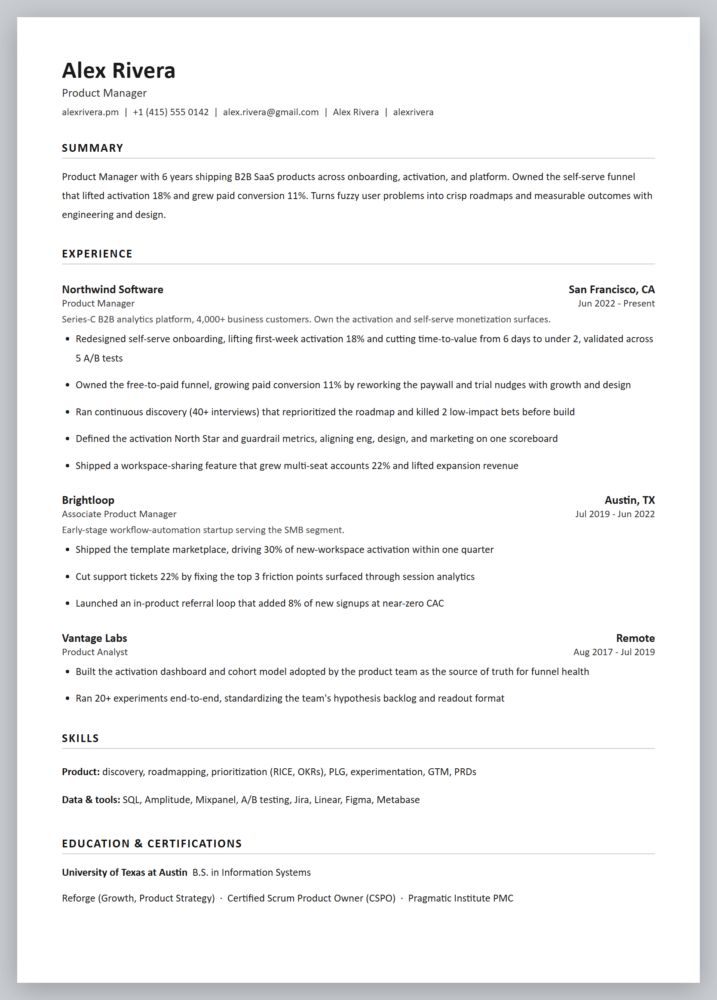
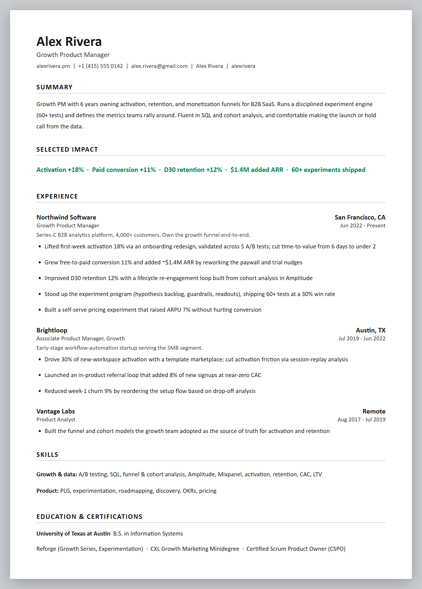
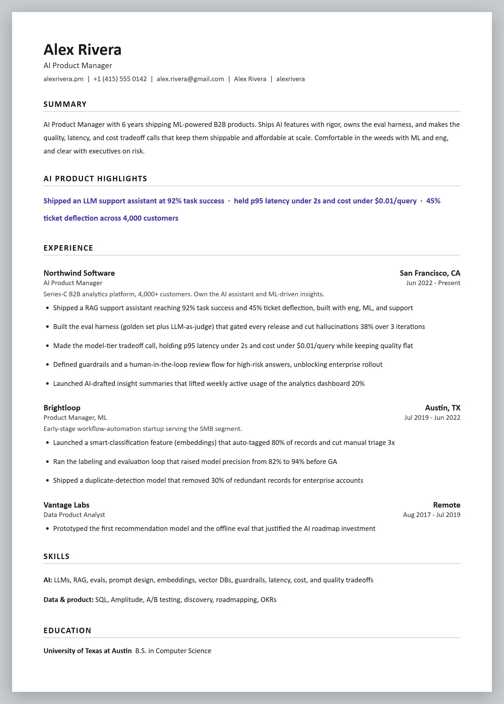
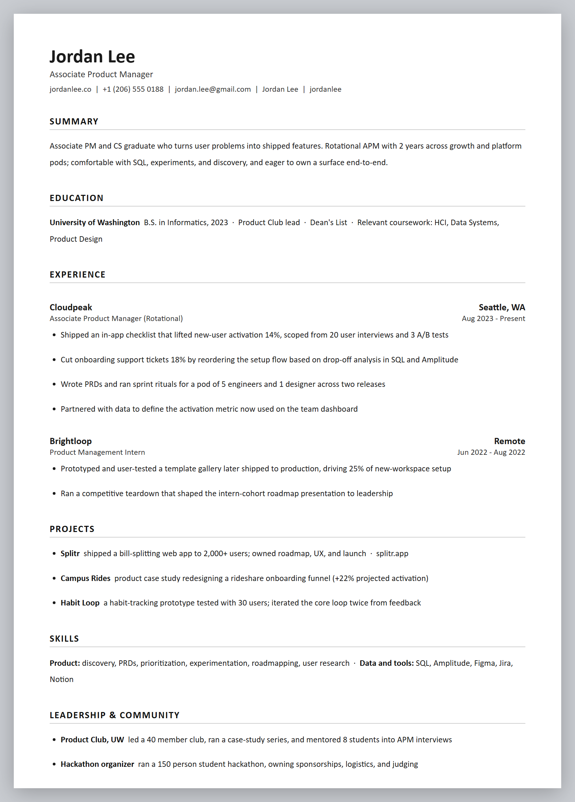

<div align="center">

# 🎯 Universal AI Resume Matcher & Builder

**A recruiter-grade, ATS-guaranteed resume tailoring engine and universal skill designed to work with ANY AI model.**

<p>
  <a href="#supported-ai-models"></a>
  <a href="#the-5-ats-guaranteed-templates"></a>
  <a href="#privacy--zero-database"></a>
  <a href="LICENSE"></a>
</p>


</div>

---

## 🌟 Overview

Most resume tools and skills are tied to a single AI ecosystem (such as Claude-only `.skill` files). **Resume Matcher** is built from the ground up as a **universal, model-agnostic resume intelligence system**. It works identically whether you use:

- **Anthropic Claude** (Claude 3.7 Sonnet, Claude 3.5 Sonnet)
- **OpenAI ChatGPT** (GPT-4o, GPT-4o-mini, o3-mini, Custom GPTs)
- **Google Gemini** (Gemini 2.5 Flash, Gemini 2.5 Pro, Gemini Gems)
- **DeepSeek** (DeepSeek-V3, DeepSeek-R1)
- **Local & Open-Source LLMs** (Ollama, LM Studio, vLLM, Llama 3.3, Mistral, Qwen)
- **AI Coding Agents** (Cursor, Windsurf, Antigravity, GitHub Copilot, Cline)

It serves two complementary workflows:
1. **Universal AI Skill & Prompt Ecosystem:** Drop-in adapters, Custom GPTs, Gemini Gems, Ollama Modelfiles, and IDE rules for any platform.
2. **Interactive Full-Stack Web Application:** A private, serverless web app (`React + Vite + Cloudflare Workers`) featuring instant client-side PDF parsing, multi-provider model selection, BYOK (Bring-Your-Own-Key) privacy, in-browser live preview, and ATS-parseable single-column PDF export.

---

## ⚡ Core Philosophy: Truth-Grounded XYZ Tailoring

Every resume produced follows the science of modern hiring pipelines:
- **The 6–8 Second Recruiter Scan:** Recruiters prioritize titles, owned scope, and quantified outcomes over passive duties.
- **Strict Anti-Hallucination Guarantee:** The candidate's master resume is the **sole factual foundation**. The engine never fabricates employers, titles, dates, certifications, tools, or metrics.
- **Google XYZ & PM TAR Formulas:** Every bullet point follows `Accomplished [X] as measured by [Y], by doing [Z]` or `[Action Verb] + [What you shipped/owned] + [Scope] + [Measurable Result]`.
- **1-Line Company & Domain Context:** Every role includes an italicized context line stating company stage, scale (e.g. `$40M SaaS, 2M users`), and owned surface area so recruiters immediately understand the stakes.

---

## 🤖 Supported AI Models & Platforms

| AI Platform | Integration Method | Configuration File / Directory |
|---|---|---|
| **Any LLM (Zero Install)** | Copy & Paste prompt into any chat window | [`skills/universal-prompt.md`](./skills/universal-prompt.md) |
| **Anthropic Claude** | `.skill` package for Claude.ai or Claude Code | [`resume-matcher.skill`](./resume-matcher.skill) / [`skills/claude/`](./skills/claude/) |
| **OpenAI ChatGPT** | Custom GPT with optional Cloudflare API Actions | [`skills/chatgpt/`](./skills/chatgpt/) |
| **Google Gemini** | Gemini Gem or Google AI Studio System Instructions | [`skills/gemini/`](./skills/gemini/) |
| **Local LLMs (Ollama)** | Local CLI or LM Studio / vLLM / Jan | [`skills/local-llm/`](./skills/local-llm/) |
| **Cursor IDE** | Root workspace rules | [`.cursorrules`](./.cursorrules) |
| **Windsurf IDE** | Cascade agent rules | [`.windsurfrules`](./.windsurfrules) |
| **Universal Agents** | Standard Agentic IDE skill & guide | [`AGENTS.md`](./AGENTS.md) / [`.agents/skills/`](./.agents/skills/) |
| **Full-Stack Web App** | Multi-model UI with BYOK key management | [`apps/web/`](./apps/web/) & [`apps/worker/`](./apps/worker/) |

---

## 📄 The 5 ATS-Guaranteed Templates

Every template is single-column, standard font, graphics-free, and guaranteed to parse cleanly in Greenhouse, Lever, Workday, Ashby, Taleo, and iCIMS.

| Preview | Template | Best For | Styling Details |
|---|---|---|---|
|  | **01 Executive Serif** | Senior, Staff, Lead, Director, Head of Product, VP, CPO, and Ex-Founders | EB Garamond / Georgia serif, centered header, thin underline dividers, high authority |
|  | **02 Modern Minimal** | Mid-level PM, SWE, and tech roles at modern tech firms | Inter / Helvetica sans-serif, left-aligned, crisp modern layout |
|  | **03 Growth & Metrics** | Growth PMs, Monetization, Performance Marketing, and Data | Adds a dedicated **"Selected Impact & Growth Highlights"** callout strip |
|  | **04 AI Product & Tech** | AI/ML PMs, ML Engineers, and Data Scientists | Highlights AI stack, model evaluation frameworks, and latency/cost tradeoffs |
|  | **05 Associate One-Pager** | APMs, early-career engineers, switchers, and new grads | High-density single-page format giving weight to projects and technical skills |

> Full layout specifications and typography guidelines are documented in [`skills/references/template-specifications.md`](./skills/references/template-specifications.md).

---

## 🚀 Quickstart Guides

### 1. Zero-Install Universal Prompt
If you just want to tailor a resume right now in **any chat window** (ChatGPT, Claude, Gemini, DeepSeek, Copilot):
1. Open [`skills/universal-prompt.md`](./skills/universal-prompt.md).
2. Copy the prompt block.
3. Paste it into your AI chat along with your master resume and target job description.

---

### 2. Anthropic Claude (Claude.ai or Claude Code)
- **Claude.ai (easiest):** Download [`resume-matcher.skill`](./resume-matcher.skill), go to **Settings → Capabilities → Skills → Upload skill**, and say: *"Tailor my master resume to this job posting."*
- **Claude Code:**
  ```bash
  mkdir -p ~/.claude/skills/user/resume-matcher
  cp -r skills/claude/* ~/.claude/skills/user/resume-matcher/
  cp -r skills/references ~/.claude/skills/user/resume-matcher/
  ```

---

### 3. OpenAI ChatGPT (Custom GPT)
1. In ChatGPT, click your profile → **My GPTs** → **Create a GPT** → **Configure**.
2. Paste the contents of [`skills/chatgpt/system_prompt.md`](./skills/chatgpt/system_prompt.md) into the **Instructions** box.
3. *(Optional)* Connect your deployed Cloudflare API using the OpenAPI schema in [`skills/chatgpt/gpt_action_schema.json`](./skills/chatgpt/gpt_action_schema.json).
4. See [`skills/chatgpt/README.md`](./skills/chatgpt/README.md) for full instructions.

---

### 4. Google Gemini (Gemini Gem or AI Studio)
1. Open [gemini.google.com](https://gemini.google.com) → **Gem Manager** → **New Gem**.
2. Paste the prompt from [`skills/gemini/gemini_system_instructions.md`](./skills/gemini/gemini_system_instructions.md).
3. Save and start chatting with your master resume!
4. See [`skills/gemini/README.md`](./skills/gemini/README.md) for details.

---

### 5. Local LLMs (Ollama / LM Studio)
Run 100% offline with zero external API calls:
```bash
cd skills/local-llm
ollama create resume-matcher -f Modelfile
ollama run resume-matcher
```
See [`skills/local-llm/README.md`](./skills/local-llm/README.md) for LM Studio and vLLM instructions.

---

### 6. AI Coding Assistants (Cursor, Windsurf, Antigravity)
- **Cursor:** Automatically recognizes [`.cursorrules`](./.cursorrules) at root.
- **Windsurf:** Automatically recognizes [`.windsurfrules`](./.windsurfrules) at root.
- **Antigravity / Agentic IDEs:** Standard skill located at [`.agents/skills/resume-matcher/SKILL.md`](./.agents/skills/resume-matcher/SKILL.md).

---

## 💻 Running the Web Application Locally

The repository includes a modern React/Vite frontend and Cloudflare Worker API in a unified monorepo.

### 1. Install dependencies
```bash
npm install
```

### 2. Run in development mode
Run the Cloudflare Worker API and Vite frontend concurrently:

```bash
# Terminal 1: Run the multi-model Worker API
npm run dev:worker

# Terminal 2: Run the Vite frontend
npm run dev:web
```

Open [http://localhost:5173](http://localhost:5173) in your browser.

### 3. Build & Package
```bash
# Build both frontend and worker
npm run build

# Package the Claude .skill bundle and validate all skill schemas
npm run package:skills
```

---

## ☁️ Cloudflare Deployment

Deploy both the React frontend and the multi-model API as a single, low-latency Cloudflare Worker using the root `wrangler.jsonc`:

### 1. Login to Cloudflare
```bash
npx wrangler login
```

### 2. Configure API Secrets (Configure any or all providers)
```bash
# OpenAI
npx wrangler secret put OPENAI_API_KEY

# Anthropic Claude
npx wrangler secret put ANTHROPIC_API_KEY

# Google Gemini
npx wrangler secret put GEMINI_API_KEY

# DeepSeek
npx wrangler secret put DEEPSEEK_API_KEY
```

> **Note:** Even if no secrets are configured on Cloudflare, end users can still use the web app by entering their own API key directly in the UI settings drawer (stored strictly in their browser `localStorage`).

### 3. Deploy
```bash
npm run deploy
```

---

## 📚 Knowledge Base & Reference Documentation

The [`skills/references/`](./skills/references/) directory contains comprehensive, battle-tested guides synthesized from top career coaches, FAANG hiring bars, and ATS engineering research:

| Guide | Description |
|---|---|
| [`bullet-writing-formulas.md`](./skills/references/bullet-writing-formulas.md) | Google XYZ & PM TAR formulas, 120+ power action verbs, before/after examples |
| [`metrics-by-archetype.md`](./skills/references/metrics-by-archetype.md) | Standard metrics and KPIs for PMs, SWEs, AI/ML Engineers, and Growth roles |
| [`template-specifications.md`](./skills/references/template-specifications.md) | Layout rules, font sizes, margins, and hierarchy for all 5 templates |
| [`ats-and-keywords.md`](./skills/references/ats-and-keywords.md) | How Greenhouse, Lever, Workday, and Taleo parse resumes; keyword optimization |
| [`resume-structure.md`](./skills/references/resume-structure.md) | Single-column layout rules, section ordering, and page length guidelines |
| [`common-mistakes.md`](./skills/references/common-mistakes.md) | 15 fatal resume traps that trigger immediate recruiter rejection |

---

## 🔒 Privacy & Zero-Database Guarantee

1. **No Central Database:** Your master resume is stored exclusively in your local browser storage (`localStorage`).
2. **BYOK Security:** If you provide your own API key in the UI, it is sent over encrypted HTTPS directly to the LLM and is never logged or persisted.
3. **SSRF Guard:** Job URL fetching automatically rejects private or local hostnames.
4. **ATS Plain-Text Export:** Allows copying clean, structured text directly for application portals without formatting issues.

---

## 📄 License

This project is licensed under the [MIT License](LICENSE).
