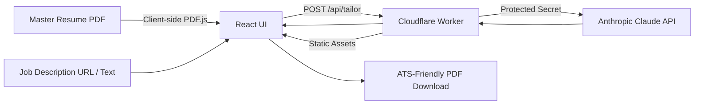

# 📄 Personal Resume Matcher — AI Resume Tailoring App

<p align="center">
  <strong>A private, serverless resume tailoring app powered by Cloudflare Workers and Anthropic Claude.</strong>
</p>

<p align="center">
  <a href="#license"></a>
  <a href="https://workers.cloudflare.com"></a>
  <a href="https://react.dev"></a>
  <a href="https://anthropic.com"></a>
</p>

---

## 📌 Overview

**Personal Resume Matcher** is a private, client-side first application designed to match and tailor master resumes against target job descriptions. It uses a single Cloudflare Worker deployment: the Worker serves the React/Vite frontend as static assets and handles `/api/*` requests in the same deployment.

This removes the old requirement to separately deploy a Pages frontend and an API Worker, avoids production CORS configuration errors, and lets the frontend call the API using the same origin.

---

## ✨ Key Features

- **🔒 Client-Side PDF Parsing:** Master resume PDFs are extracted directly in the browser using `pdf.js`; no resume database is used.
- **🎯 Truth-Grounded XYZ Tailoring:** Rewords and prioritizes verified resume evidence for the target role without inventing credentials or metrics.
- **⚡ Protected Serverless API:** Anthropic credentials remain in the encrypted `ANTHROPIC_API_KEY` Cloudflare Worker secret.
- **📄 Instant PDF Download:** Generates a simple ATS-friendly, single-column PDF for review and download.
- **🌐 Single-Origin Deployment:** Frontend and API are served by one Cloudflare Worker, so production does not depend on a hard-coded API URL.

---

## 🏗️ Architecture



---

## 🚀 Recommended Cloudflare Deployment

The repository now has a root `wrangler.jsonc` that deploys both `apps/web/dist` and `apps/worker/src/index.ts` as one Worker.

### 1. Clone and install

```bash
git clone https://github.com/MadanMohan0537/Resume-Matcher.git
cd Resume-Matcher
npm install
```

### 2. Configure the Anthropic API secret

```bash
npx wrangler login
npx wrangler secret put ANTHROPIC_API_KEY
```

Paste your Anthropic API key when prompted. Do **not** put the real key in `.env`, source code, or GitHub.

### 3. Deploy

```bash
npm run deploy
```

The root deploy command:

1. builds the React/Vite frontend,
2. type-checks the API Worker,
3. uploads the generated frontend assets,
4. deploys the Worker API and frontend together.

### Cloudflare Git integration

If you connect this GitHub repository directly in the Cloudflare dashboard, use the repository root (do not select `apps/web` as the root).

- **Root directory:** `/` (repository root)
- **Build command:** `npm run build`
- **Deploy command:** `npx wrangler deploy`
- **Worker config:** `wrangler.jsonc`
- **Required secret:** `ANTHROPIC_API_KEY`

Do not set `VITE_API_URL` for the production single-Worker deployment. The frontend uses same-origin `/api/tailor` automatically.

---

## 💻 Local Development

For local development, run the API and Vite frontend separately:

```bash
# Terminal 1
npm run dev:worker

# Terminal 2
VITE_API_URL=http://localhost:8787 npm run dev:web
```

You can also create `apps/web/.env.local` containing:

```env
VITE_API_URL=http://localhost:8787
```

Keep secrets out of frontend environment variables.

---

## Repository Structure

```text
Resume-Matcher/
├── wrangler.jsonc          # Production combined Worker + assets config
├── package.json
└── apps/
    ├── web/                # React + Vite frontend
    │   └── dist/           # Generated during build
    └── worker/             # Cloudflare API Worker
        └── src/index.ts
```

Legacy per-app Wrangler configs are retained for local/separate deployment workflows, but the root deployment is the recommended production path.

---

## 🛡️ Privacy & Security

1. **No resume database:** The master resume is kept in browser local storage.
2. **Protected API key:** `ANTHROPIC_API_KEY` is stored as a Cloudflare Worker secret.
3. **SSRF guard:** Job URL fetching blocks local/private hostnames.
4. **Same-origin API:** The recommended deployment avoids exposing or maintaining a separate backend URL in frontend configuration.

---

## Troubleshooting

### `ANTHROPIC_API_KEY is not configured`

Add the Worker secret:

```bash
npx wrangler secret put ANTHROPIC_API_KEY
```

### Frontend tries to call `localhost:8787`

Update to the latest `main` branch. Production now defaults to same-origin API requests and does not require `VITE_API_URL`.

### Cloudflare cannot find the frontend output

Make sure Cloudflare runs:

```bash
npm run build
```

before:

```bash
npx wrangler deploy
```

and make sure the root directory is the repository root rather than `apps/web`.

---

## 📄 License

MIT License.
