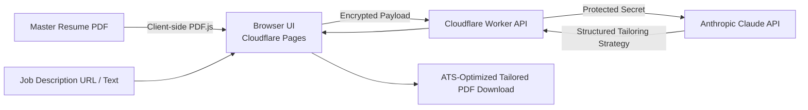

# 📄 Personal Resume Matcher — AI Resume Tailoring App

<p align="center">
  <strong>A private, serverless resume tailoring app powered by Cloudflare Pages, Cloudflare Workers, and Anthropic Claude.</strong>
</p>

<p align="center">
  <a href="#license"></a>
  <a href="https://workers.cloudflare.com"></a>
  <a href="https://react.dev"></a>
  <a href="https://anthropic.com"></a>
</p>

---

## 📌 Overview

**Personal Resume Matcher** is a private, client-side first application designed to match and tailor master resumes against target Job Descriptions. Adapted from the core principles of the open-source [Resume Matcher](https://github.com/srbhr/Resume-Matcher), this architecture is engineered for **strict single-user privacy, serverless edge speed, and zero database overhead**.

---

## ✨ Key Features

- **🔒 Client-Side PDF Parsing:** Master resume PDFs are extracted and parsed directly in your browser session using `pdf.js` — your private CV data is never uploaded to an external database.
- **🎯 Truth-Grounded XYZ Tailoring:** Reformulates verified accomplishments using target JD keywords without fabricating unverified metrics or credentials.
- **⚡ Protected Serverless Edge API:** Deployed on **Cloudflare Workers**, protecting your Anthropic API key behind encrypted runtime secrets so credentials never touch the browser.
- **📄 Instant PDF Download:** Produces an ATS-friendly, single-column formatted PDF ready for immediate job application submissions.

---

## 🏗️ Architecture



---

## 🚀 Quick Start & Deployment

### 1. Repository Structure
- `apps/web`: React + Vite single-page application (Cloudflare Pages).
- `apps/worker`: Cloudflare Worker API proxy and prompt engine.

### 2. Deploy the Worker API

```bash
# Clone the repository
git clone https://github.com/MadanMohan0537/Resume-Matcher.git
cd Resume-Matcher

# Deploy Worker
cd apps/worker
npm install
npx wrangler secret put ANTHROPIC_API_KEY
npx wrangler deploy
```

### 3. Deploy the Frontend (Cloudflare Pages)

Connect the repository in Cloudflare Pages:
- **Root Directory:** `apps/web`
- **Build Command:** `npm run build`
- **Output Directory:** `dist`
- **Environment Variable:** `VITE_API_URL=https://resume-matcher-api.<your-subdomain>.workers.dev`

### 4. Local Development

```bash
# Terminal 1: Run Worker locally
cd apps/worker && npm run dev

# Terminal 2: Run Web Frontend
cd apps/web && npm run dev
```

---

## 🛡️ Privacy & Security Design

1. **Zero Database Retention:** No applicant tracking data or master resumes are stored on a server.
2. **Encrypted Runtime Secrets:** Anthropic API keys are bound as Cloudflare runtime secrets.
3. **SSRF Guard:** Worker URL fetching blocks local network IPs and loops.

---

## 📄 License

MIT License — see [LICENSE](LICENSE) for details.
