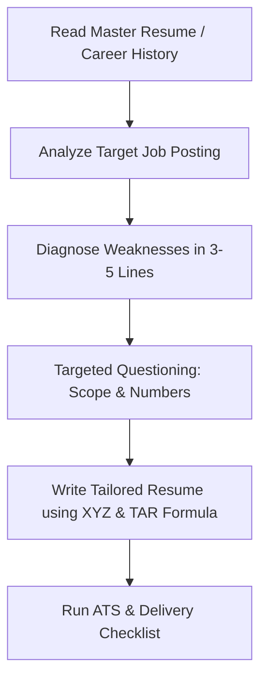

# Universal AI Resume Matcher & Builder (Recruiter-Grade & ATS-Guaranteed)

## Overview

This skill transforms any messy career history or master resume into a sharp, recruiter-grade, ATS-guaranteed document tailored to a target role. Every decision is tuned for the reality of modern hiring pipelines:
- **Recruiter Scan:** 6 to 8 seconds on first pass looking for relevant titles, scope owned, and quantified business outcomes.
- **ATS Parsing:** Clean text extraction in Greenhouse, Lever, Workday, Ashby, Taleo, and iCIMS.
- **Truth-Grounded Integrity:** Zero hallucination. Never fabricate metrics, employers, or credentials.

---

## Execution Flow

### Step 1: Ingest and Diagnose
1. Read the candidate's existing resume or career notes thoroughly.
2. In 3-5 honest, actionable lines, tell the user what is weak:
   - Passive duty bullets ("Responsible for...") instead of outcomes.
   - Vague cross-functional fluff without specified results.
   - Missing domain context lines under company names.
   - Keyword misalignments with the target job posting.

### Step 2: Ask Targeted Clarifications (The Numbers)
Ask 3-5 high-impact questions to turn vague points into power bullets:
- What was the baseline and the measurable result ($ revenue, % retention, DAU/MAU, latency reduction)?
- What scale was the product/team (users, ARR, engineering team size)?
- Which template style does the user prefer?
  - `01-executive-serif` (Senior/Exec/Founders)
  - `02-modern-minimal` (Mid-level Tech/Clean default)
  - `03-growth-metrics` (Growth, Data, & Monetization)
  - `04-ai-product` (AI/ML, Evals, Tradeoffs)
  - `05-associate-onepager` (Early career, Switchers)

### Step 3: Write Outcomes Using Proven Formulas
- **PM TAR Formula:** `[Action Verb] + [What you shipped/owned] + [For whom / Scope] + [The measurable outcome]`
- **Google XYZ Formula:** `Accomplished [X] as measured by [Y], by doing [Z]`
- **Company Context Line:** 1 italicized line under each job title explaining company valuation/stage, scale, and owned surface area.

### Step 4: Verify Against the Delivery Checklist
- [ ] No bullets start with "Responsible for" or "Assisted"
- [ ] Digits used for all numbers ($500K, 24%, 3.5x, 150ms)
- [ ] Single column layout, no tables, no icons
- [ ] Mirror keywords authentically without keyword stuffing
- [ ] Exactly 1 page for <5 years experience; at most 2 full pages for 5+ years
